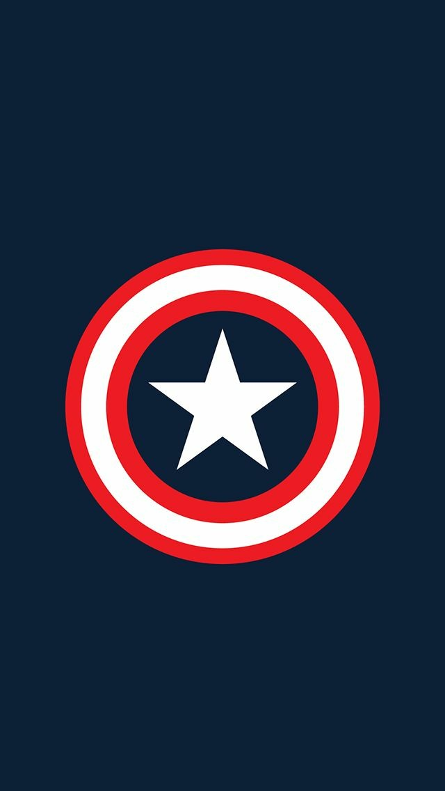

<!-- Headings -->

# Title

## Subtitle

<!-- italic text -->

This is an _italic_ text

<!-- strong text -->

This is an **strong** text

<!-- strikethrough -->

This is an ~~strikethrough~~ text

<!-- UL -->

- apple
  - apple2
- orange
- etc

<!-- OL -->

1. orange
   1. orange 2
2. apple
3. etc

<!-- Links -->

[google.com](https://www.google.com)

[google.com](https://www.google.com "Custom title")

<!-- Quotes -->

> this is a quote

<!-- Lines -->

---

---

<!-- Code -->

`console.log('hello world')`

<!-- Code sections -->

```javascript
import "../styles/globals.css";
import type { AppProps } from "next/app";

export default function App({ Component, pageProps }: AppProps) {
  return (
    <section className=" dark:bg-gray-800 bg-blue-200 min-h-screen grid place-content-center">
      <Component {...pageProps} />
    </section>
  );
}
```

<!-- Tables -->

| Header | Header | Header |
| ------ | ------ | ------ |
| asd    | asd    | asd    |
| ------ | ------ | ------ |
| ------ | ------ | ------ |

<!-- Images -->



<!-- GITHUB MARKDOWN -->

- [x] task 1
- [ ] task 2
- [ ] task 3
- [x] task 4

<!-- Emojis -->

### Emojis

👍
😄
